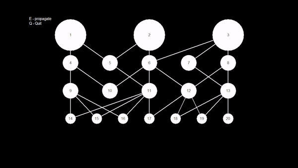
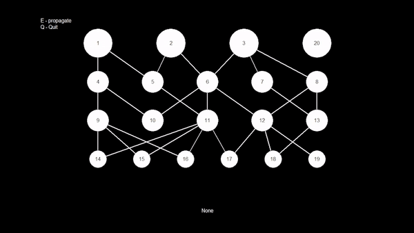

# Overview

Inspired by my introductory programming classes.<br />
I wanted to visualize recursion when applied to searching algorithms, and so I built this tool for that!<br />
Feel free to edit my code (`func_edit` is the search function) and build different graphs (`graph.data`).<br>
This project was made possible with `John Zelle's` graphics.py.

# Example: Depth Search (default implementation)

<p align="center">
  
</p>

# Example: Breadth-wide Search

<p align="center">
  
</p>

# graph.data syntax

To create a node, type:
```
NODE NUM {...}
```
{...} are expressions like a=1 or b=0.01, which are node propreties.

To connect nodes, type:
```
ADD X Y
```
The 'arrow' points `from X to Y`.<br />
Y is dependant on X.

# Run it

Execute `run.py` to start the program. *ENJOY!*
